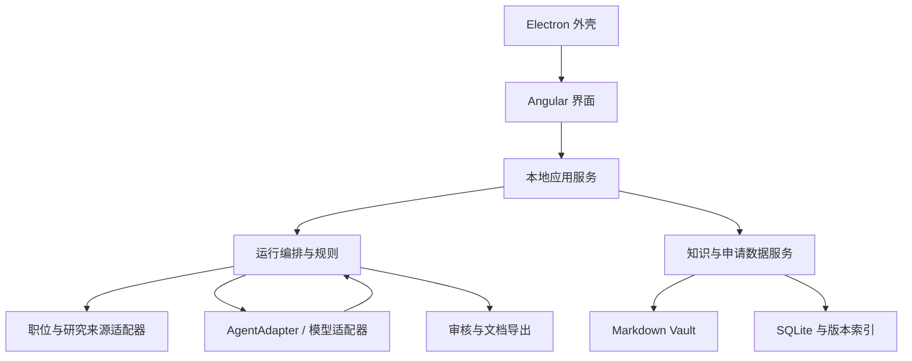

# 个人 AI 求职工作台：产品方案与版本路线图

文档版本：0.1  
整理日期：2026-09-28  
状态：产品设计草案，可作为后续 PRD、架构设计和开发任务拆分的输入。  
暂定英文名称：Job Search Workbench。

> **部分已被取代（2026-09-30）**：本文保留 2026-09-28 的原始设计。其中的本地优先、SQLite、Markdown 主数据和 Electron 路线已被云端 PostgreSQL（Railway + Neon）决策覆盖；文中的数量、预算和示例不是已确认默认值。实施以 [DEVELOPMENT.md](DEVELOPMENT.md) 和 [TASKS.md](TASKS.md) 为准。

> 建立一个本地优先、能够持续理解个人经历与求职偏好的应用。每次运行前，由用户指定职位方向、公司条件、数量和预算；系统在指定来源内发现机会，解释匹配理由，生成有真实经历支撑的申请材料，并支持公司研究、面试准备与投递追踪。

快速导航：[运行前配置](#3-每次运行前的配置) · [个人事实库](#5-个人事实库与求职资料) · [技术架构](#12-技术架构与模块边界) · [版本路线图](#16-版本路线图) · [验收标准](#17-验收标准与质量评估) · [配置示例](#18-一次运行的配置示例)

## 1. 已确定的方向与设计原则

### 1.1 已确定的产品方向

- 首先服务个人使用，提供本地 Web 应用，并逐步加入 Electron 桌面端。
- 组合使用 Electron、TypeScript 前端、DeepSeek Harness、Obsidian Vault 和 LLM Wiki 思路，但各自职责清晰。
- 保存个人技能、工作经历、项目成果、求职偏好及申请所需资料。
- 根据具体 JD 生成针对性的简历、求职信、公司介绍和面试准备材料。
- **每次运行前配置工作范围、筛选条件、发现数量、材料数量和申请目标。**
- **不做全网爬虫，不做自动海投。**
- 未来可扩展多用户、复杂多 Agent 协作、知识图谱可视化和跨设备实时同步。

### 1.2 必须一直保留的原则

| 原则 | 对产品行为的要求 |
| --- | --- |
| 真实经历优先 | 模型优化表达和重点，不能添加未经确认的经历、技术、年限或数字 |
| 来源可追溯 | 个人事实、JD、公司研究和生成材料能够追溯到来源及版本 |
| 有界执行 | 来源、数量、时间、费用和工具权限都有明确边界 |
| 用户掌握投递决定 | 准备材料与实际申请分离；后台发现和生成不代表授权发送 |
| 保留未知 | JD 未写、来源矛盾或资料不足时显示未知，不默认为满足 |
| 数据可迁移 | 核心经历不锁在模型会话内；支持 Markdown 和结构化数据导出 |
| 可解释的筛选 | 展示入选、淘汰、待确认的原因，不只给一个分数 |
| 先验证个人价值 | 先完成真实申请流程，再逐步增加平台化能力 |

文中的数量、预算、技术细节和版本编号均为**建议方案或示例**，不代表已实现功能，也不代表用户已确认了这些默认偏好。未来版本是能力路线图，不是工期承诺。

## 2. 产品目标与典型使用场景

主要目标是减少发现、判断、准备和回顾一份申请所需的重复劳动，同时保持内容真实、投递可控。

| 场景 | 用户操作 | 期望结果 |
| --- | --- | --- |
| 定向发现职位 | 选择“芬兰后端与 AI 岗位”预设，配置本次数量和来源 | 得到可解释的候选清单及待确认事项 |
| 分析单个职位 | 粘贴 JD 或导入有权使用的职位文件 | 判断值得申请的原因、能力缺口及需要补充的问题 |
| 准备申请 | 选中职位、确认可用经历和模板 | 简历与求职信草稿，逐句可查看证据 |
| 了解公司 | 选择研究深度与资料新鲜度 | 带来源和日期的公司说明及面试提问建议 |
| 准备面试 | 选择具体申请记录和面试类型 | 结合当时投递材料的技术题、项目追问与模拟面试 |
| 积累经历 | 记录新项目、决策和成果，确认个人事实 | 可在以后申请中复用的经历与故事库 |
| 回顾求职进展 | 查看投递状态、反馈、投入时间和费用 | 找到需要调整的方向，而非单纯追求申请数量 |

初始可以建立 Backend Engineer、AI/Agent Engineer、Backend + AI Automation 等不同求职画像。同一份经历在不同画像下改变展示重点，不改变事实。

## 3. 每次运行前的配置

### 3.1 配置层级与生效方式

配置分为四层：个人长期资料、保存的搜索预设、本次覆盖参数、运行时冻结的配置快照。

用户选择预设后可以修改本次参数，默认不覆盖原预设。启动后保存 `run_id`、配置版本、个人资料版本和时间；运行中不静默改变条件。用户修改范围时，暂停并记录修订，或创建一次新运行。

业务偏好可以按本次需要覆盖，但预算上限、来源权限和发送权限必须由应用规则校验，模型不能自行放宽。

### 3.2 数量控制：发现、生成和申请分别设置

| 配置项 | 示例 | 明确定义 |
| --- | --- | --- |
| 本次发现目标 | 20 个 | 去重后、本次新发现且通过硬条件检查的职位目标；不是保证交付数量 |
| 处理候选上限 | 150 个 | 本次最多处理的原始候选记录数；与分页请求、响应大小上限分别控制 |
| 待确认结果上限 | 10 个 | 缺少硬条件信息的职位单独列出，不混入已满足条件的 20 个 |
| 短名单上限 | 8 个 | 本次重点展示并建议用户审核的职位数量 |
| 生成材料上限 | 5 套 | 最多为 5 个用户选中的职位生成材料；一套可包含简历和求职信 |
| 申请目标 | 3 个 | 用户本次计划完成的实际申请数量，用于待办和进度 |
| 申请计划上限 | 3 个 | 本次加入申请待办的职位上限；用户可以显式调整并保留记录 |
| 单家公司上限 | 2 个 | 限制同一家公司占据短名单的数量，统计范围明确标为短名单 |
| 研究公司上限 | 5 家 | 限制深入研究的公司数；基础信息解析不必等同于深入研究 |
| 本次时间上限 | 30 分钟 | 限制后台处理时间，人工审核等待不计入 |
| 本次费用预算 | 用户填写 | 统一核算模型、搜索等付费服务的估算费用和实际费用 |

**“申请 3 个”表示帮助用户组织并完成 3 份人工申请，不表示后台自动发送 3 份申请。**

数量计算必须遵守以下规则：

1. 生成草稿、导出文件、打开申请页面，都不能计为已申请。
2. 用户确认自己已提交后，才能记录为已申请；同时记录确认方式、时间及可选的回执。
3. 同一职位在多个来源出现只算一个；已有职位的内容更新单独计为更新，不计为新发现。
4. 重新生成同一职位的材料不增加职位套数，但继续消耗生成次数、时间和费用预算。
5. 结果不足时报告“找到 12/20”，说明来源覆盖、筛选条件或预算等原因，不扩大网站范围、不降低标准凑数。
6. 申请目标未完成不是后台任务失败；分别展示“准备完成”和“用户已申请”。
7. 应用中的计划上限只能约束应用管理的工作，不能宣称阻止用户在外部网站自行申请。

默认批次模式下，配置建议满足：申请目标 ≤ 申请计划上限 ≤ 材料上限 ≤ 短名单上限 ≤ 发现目标。对已有材料或已有职位的继续申请，使用“从已有职位准备”模式单独校验，不强行套用新发现数量关系。

### 3.3 岗位筛选条件

| 类别 | 可配置字段 | 处理要求 |
| --- | --- | --- |
| 岗位方向 | 后端、全栈、AI Engineer、Agent、自动化、DevOps、游戏开发等 | 支持多选、职位名别名和关键词；允许建立不同画像 |
| 技术要求 | Java、Spring Boot、TypeScript、LLM、RAG、Kubernetes 等 | 区分必须、优先和排除；区分“全部满足”与“任一满足” |
| 职级与职责 | Junior、Mid、Senior、Lead、IC、管理岗 | 结合职责分析，不能只按职位名判断 |
| 地区 | 国家、城市、可接受通勤范围 | Remote 仍需确认实际可雇佣地区 |
| 办公方式 | Remote、Hybrid、On-site；到岗频率 | 未写到岗频率时保留未知 |
| 工作语言 | 英语、芬兰语等及要求级别 | 英文 JD 不等于只需英语工作 |
| 雇佣形式 | 全职、兼职、固定期限、合同工、实习 | 与公司行业、职位方向分别记录 |
| 工作时间 | 每周工时、时区重叠、出差、值班 | 可配置硬条件或软偏好 |
| 薪资 | 最低期望、目标区间、币种、月薪/年薪/时薪 | 保存税前/税后、基本工资/总包口径；缺失时不假定达标 |
| 工作许可相关要求 | 可雇佣地区、是否明确支持所需安排 | 仅根据用户资料和招聘方信息匹配，不自动作法律资格判断 |
| 发布时间 | 近 7/14/30 天、截止日期 | 发布时间、更新时间和首次发现时间分开 |
| 包含与排除 | 包含词、排除词、排除公司、排除猎头等 | 排除原因可见，规则可回溯 |
| 历史去重 | 已申请、已忽略、之前看过的职位 | 分别设置是否隐藏和重新提示周期 |

薪资币种转换应保存汇率日期和原始数值；未知工资周期不能直接换算。用户未设置薪资底线时不替用户填写。

### 3.4 公司筛选条件

岗位方向与公司行业必须分开：例如“金融公司的后端岗位”和“科技公司的财务岗位”是不同组合。

| 类别 | 可配置选项 | 说明 |
| --- | --- | --- |
| 员工规模 | 1–10、11–50、51–200、201–500、501–1,000、1,001–5,000、5,001+ | 支持多选，也可输入自定义范围；这些是产品区间，不是通用法定分类 |
| 规模口径 | 实际雇佣实体、全球集团、当前团队 | 三者分开保存；推荐用实际雇佣实体筛选 |
| 行业 | SaaS、AI、金融科技、游戏、咨询、制造等 | 多标签，允许未知 |
| 公司阶段 | 初创、成长、成熟、上市等 | 与员工规模独立；融资阶段应有来源和日期 |
| 业务形式 | 产品公司、咨询外包、代理招聘等 | 支持优先或排除，不靠公司名称猜测 |
| 关注名单 | 指定公司、排除公司、已联系公司 | 关注名单也用于确定职位来源范围 |
| 工作环境偏好 | 国际化团队、产品所有权、技术成长机会等 | 一般用于排序和待确认问题，不伪装成确定事实 |

公司规模可能不准确或过时。必须记录来源、获取日期和口径；无法确认时按未知策略处理，不能依据品牌知名度推测人数。

### 3.5 硬条件、软偏好与未知策略

每个筛选项包含 `value`、`strength` 和 `unknown_policy`：

- `strength: hard`：已知不满足则淘汰，软分数不能抵消。
- `strength: soft`：用于排序，不单独淘汰。
- `unknown_policy: review`：放入待确认列表，显示缺失信息。
- `unknown_policy: exclude`：本次排除，但理由必须是信息不足，不能写成确定不符合。
- `unknown_policy: allow_with_warning`：允许继续查看或准备草稿，保持未知标识；仍不计入“硬条件已确认通过”的数量。

对工作语言、雇佣地区等关键字段，建议默认 `review`。如果允许在信息未齐时准备材料，用户需明确接受该不确定性；系统不得生成“全部条件满足”的结论。

### 3.6 来源、输出与执行设置

| 配置组 | 可配置内容 |
| --- | --- |
| 职位来源 | 手动导入、指定公司的 ATS 招聘板块、已核验可使用的招聘页面、选定邮件 |
| 来源范围 | 公司关注名单、招聘板块标识、允许的域名、各来源请求预算与限流 |
| 本次任务 | 仅发现、发现并分析、为已选职位准备材料、公司研究、面试准备 |
| 输出内容 | 简历、求职信、职位匹配报告、公司简报、面试准备清单 |
| 语言与模板 | 内部分析语言、投递材料语言、模板、篇幅、语气、可公开的联系方式 |
| 研究深度 | 基础资料、岗位相关研究、面试前更新；每公司来源数上限 |
| 模型执行 | 模型适配器、模型选择、超时、最大输出、重试上限、并发和费用预算 |
| 数据发送 | 当前任务允许使用的资料集合，禁止外发的敏感字段 |
| 审核 | 短名单确认、材料审核、待确认问题处理 |
| 调度（后续） | 手动或定时运行、时区、通知方式；定时任务只发现、分析或准备待审草稿 |

自然语言配置可在后续加入，例如“找 20 个芬兰中型公司的英语后端或 AI 岗位，为我选中的 5 个准备材料，我计划申请 3 个”。系统先转换成可见表单供检查，再启动；没有明确值的项目不得自行猜成用户偏好。

### 3.7 启动前预览与运行结果

启动页展示：本次范围、硬条件、未知策略、数量目标、输出类型、费用上限，以及需要用户审核的环节。来源尚未配置时，引导导入 JD 或添加公司来源，不显示具有误导性的“全网搜索”按钮。

运行页展示：已处理记录、去重职位、合格职位、待确认职位、淘汰理由、已生成材料、耗时、费用和停止原因。支持暂停、取消和恢复，已完成结果保留。

示例结果：读取 80 条记录 → 去重后 60 个 → 已确认合格 12 个、待确认 7 个、淘汰 41 个 → 用户选择 5 个生成材料 → 用户最终确认已申请 3 个。发现目标若是 20，明确标记仅完成 12/20。

## 4. 完整业务流程

| 步骤 | 系统工作 | 用户介入与输出 |
| --- | --- | --- |
| 1. 准备个人资料 | 解析导入的经历，识别缺项与冲突 | 用户确认事实及公开表述 |
| 2. 配置本次运行 | 校验条件、来源、数量和预算 | 用户检查配置摘要并启动 |
| 3. 获取职位 | 从已配置来源取数，保存原始快照 | 来源失败时给出状态，可改为手动导入 |
| 4. 去重与初筛 | 规则先筛选，再做必要的模型解析 | 合格、待确认、淘汰分开 |
| 5. 匹配与排序 | 建立 JD 要求与个人证据的映射 | 用户挑选值得准备的职位 |
| 6. 研究与生成 | 研究选中公司，生成结构化申请草稿 | 显示来源、证据及不确定性 |
| 7. 校验与审核 | 检查事实、数字、日期、格式和敏感信息 | 用户修订，确认最终材料版本 |
| 8. 导出与申请 | 导出文件，提供申请页面入口 | 用户在招聘网站完成提交 |
| 9. 记录申请 | 冻结当时的 JD、个人资料和投递材料 | 用户确认提交状态与时间 |
| 10. 面试与复盘 | 基于该次申请准备面试并整理反馈 | 用户确认新增经历或反馈事实 |

本地 Web MVP 的“一份 JD 流程”从手动导入开始；多来源职位发现加入后，仍复用后半段流程。

## 5. 个人事实库与求职资料

### 5.1 简历是输出，事实库是基础

| 资料类型 | 保存内容 |
| --- | --- |
| 基本资料 | 姓名、公开联系方式、所在地、作品链接；敏感字段独立保护 |
| 工作经历 | 公司、职位、起止日期、职责、个人贡献、技术和可公开的结果 |
| 项目经历 | 背景、团队规模、本人角色、具体行动、设计取舍、结果和反思 |
| 技能证据 | 使用场景、深度、最近使用时间、对应项目、学习或生产使用状态 |
| 教育与语言 | 学历、证书、语言能力及确认状态 |
| 面试故事 | STAR 故事、技术决策、失败复盘、合作与冲突处理 |
| 求职偏好 | 岗位画像、地区、语言、办公方式、合同形式及薪资口径 |
| 申请补充信息 | 入职时间、公开链接、常见表单答案；敏感答案仅在需要时使用 |

技能状态至少区分：工作中使用、个人项目实践、正在学习、概念了解、尚未确认。可迁移能力可以被解释，但不能自动转化为某个指定工具的实际使用经验。

### 5.2 个人事实的最小字段

| 字段 | 含义 |
| --- | --- |
| `fact_id` / `version` | 稳定标识和版本 |
| `statement` | 一项尽可能明确的个人事实 |
| `source_refs` | 本人确认记录、经历笔记或有权使用的原始材料 |
| `verification_status` | proposed / confirmed / disputed / retired |
| `confirmed_at` / `confirmed_by` | 确认时间与确认者 |
| `valid_from` / `valid_to` | 适用时间，避免混淆过去与当前能力 |
| `experience_type` | 工作、个人项目、学习等 |
| `confidentiality` | 可公开、内部分析、禁止外发等 |
| `public_statement` | 获准在投递材料中使用的表述 |

用户自行陈述并确认可以作为证据，不要求每条经历都上传证明。已有简历导入后先生成候选事实；用户确认后才进入可信事实集合。

AI 生成的简历、求职信、匹配报告或 Wiki 摘要，不能自动成为新的个人经历证据。模型提出的新事实、量化成果或能力推断只能进入待确认区。

当 Obsidian 中的事实正文被修改时，即使文件仍保留 `confirmed` 标记，也必须根据内容版本使原确认失效，重新确认后才能用于正式生成。旧申请保留其冻结版本，不因当前事实更新而被改写。

## 6. 职位来源与数据质量

### 6.1 来源接入顺序

| 来源 | 产品接入方式 | 适用阶段 |
| --- | --- | --- |
| 用户提供的 JD | 粘贴文本、导入有权使用的文件、保存原始链接 | MVP 必备 |
| LinkedIn 等招聘平台 | 保留来源链接，支持用户主动提供有权使用的 JD；不建设登录态自动抓取和自动投递 | MVP 保留导入入口 |
| Greenhouse | 为关注公司配置招聘板块标识，通过公开职位接口读取 | 定向发现阶段 |
| Lever | 为关注公司配置 site 和对应区域接口 | 定向发现阶段 |
| Ashby | 为关注公司配置 job board，读取公开列出的职位 | 定向发现阶段 |
| 公司官网、明确开放的职位 Feed | 逐站确认许可、访问方式与限流后添加适配器 | 按需扩展 |
| 职位提醒邮件 | 先导入用户选中的邮件，再考虑限定文件夹的只读连接 | 后续版本 |

Greenhouse 的 Job Board GET 接口无需认证；Lever 和 Ashby 也提供按公司招聘板块读取职位的接口。这些来源需要先知道目标公司的招聘板块，并不等同于覆盖所有公司的搜索服务。[Greenhouse][ref-greenhouse]、[Lever][ref-lever]、[Ashby][ref-ashby] 的官方文档是实现依据。

公开读取职位不代表个人开发者拥有申请提交权限。初期统一跳转招聘网站，由用户提交；任何后续接口集成都需另行确认权限和使用条件。Ashby 的 `isListed=false` 职位不应被放进主动发现清单。

目标公司关注列表是自动发现的起点。后续可加入有界的公司发现功能：基于用户指定行业和地区，通过允许的搜索服务提出少量候选公司，由用户加入关注名单后再持续监控。

### 6.2 职位记录与去重

每个职位至少保存：来源类型、来源职位 ID、规范链接、公司与雇佣实体、原始 JD、解析结果、发布日期、首次发现时间、获取时间、最后核验时间、内容版本及哈希。

去重优先使用来源 ID 和招聘方职位编号，再结合规范链接及公司/职位/地点判断。模糊匹配只标记疑似重复，不自动合并不同团队、不同地点或不同招聘编号的岗位。

同一职位的多个来源记录保留在来源表中，统一关联业务职位。重新发布需保留历史关系，不能擅自视为已经申请过或完全新岗位。

### 6.3 新鲜度与故障处理

- 区分公开招聘中、明确关闭、暂时不可访问、状态待确认。
- 请求超时、登录要求、接口限流或临时 404 不足以直接证明职位关闭。
- 申请前与面试前重新核验关键内容；JD 变化时标出差异，必要时让用户重审材料。
- 请求重试有上限，尊重来源限流；源站失败不影响已导入职位的后续工作。
- 不绕过登录、验证码或访问限制；保留手动导入路径。

## 7. 职位匹配与解释

匹配先经过确定性规则，再由模型做语义解释。硬条件未满足的职位不能被高软分数提升为“合格”。

核心输出是一张证据映射表：

| JD 要求 | 个人事实依据 | 匹配类型 | 不确定性或行动 |
| --- | --- | --- | --- |
| 指定后端技术 | 已确认的项目事实 ID | 直接匹配 | 准备项目细节和技术取舍 |
| 分布式部署能力 | 相关架构和运维经历 | 可迁移能力 | 不声称使用过未记录的平台 |
| 某 AI 平台经验 | 未找到已确认事实 | 缺口 | 明确缺口，准备可迁移能力说明 |
| 团队工作语言 | JD 未说明 | 待确认 | 向招聘方确认 |

上表为输出结构示例，不是对用户实际能力或某个实际职位的判断。

建议展示四部分：申请建议、主要优势、真实缺口、待确认事项。可以保留透明的排序分数，但它只表示所选规则下的相对匹配，不能称为面试概率或录用概率。信息覆盖率与匹配分数分别显示。

排序可综合技能证据、岗位方向、地点与办公偏好、公司偏好、职位新鲜度；权重由预设管理。分数版本及证据版本需随运行保存，避免规则修改后历史结论无法解释。

用户可以补充证据、纠正 JD 解析、忽略职位及填写原因。修正反馈用于改进规则或提出偏好建议；没有明确反馈时，不根据一次拒信自动改变用户画像。

## 8. 简历、求职信与导出

### 8.1 生成流程

1. 解析 JD，区分必须要求、加分项和未知条件。
2. 选取已确认且允许公开的事实，记录本次资料快照。
3. 生成结构化内容，例如摘要、经历条目、技能列表和求职信段落。
4. 每条个人经历陈述绑定事实 ID；公司陈述绑定外部来源。
5. 检查公司名、日期、数字、技能、职责和保密字段，检测无证据陈述。
6. 用户查看草稿差异、依据及待确认问题，完成修订。
7. 用固定模板渲染并导出，保存审核版本和文件哈希。

模型负责选择重点和调整表达，排版交给模板。没有确认过的量化成果不得补造；职责范围和个人贡献不能扩大。普通连接句不必关联事实，但不能夹带新的履历结论。

### 8.2 材料审核界面

点击一条简历内容或求职信中的经历陈述，可查看它使用的事实、响应的 JD 要求、与原文的变化。问题标记至少包括：缺少证据、数字变化、时间冲突、涉及敏感信息和来源已更新。

用户编辑后重新执行相关校验。材料审核只确认内容版本，不代表已经向任何公司发送。内部证据 ID、提示词、薪资底线和工作许可内部记录不进入正式投递文件。

### 8.3 模板与格式

- MVP 使用单栏、文字可复制、日期统一的简历模板，支持英文材料和中文内部分析。
- 优先输出 PDF；DOCX 按实际招聘需要加入独立模板。文件名包含公司、岗位、文档类型和版本，避免混用。
- Electron 版可评估 `printToPDF`；本地 Web 版采用独立导出适配器，避免依赖 Electron 才能完成核心流程。
- 验收包括视觉检查、分页、缺字、截断、超链接和文本提取；不承诺无法验证的“ATS 满分”。
- 求职信内容围绕真实契合点、本人贡献和申请动机；公司宣传语不能作为个人经验的证据。

## 9. 公司研究与面试准备

### 9.1 公司简报

| 内容 | 期望回答 |
| --- | --- |
| 基本情况 | 公司做什么，主要产品、客户、行业、地点和规模是什么 |
| 岗位背景 | 已知团队和职责是什么；该岗位可能要解决什么问题 |
| 与个人经历的联系 | 哪些真实经历可能对公司有价值 |
| 近期信息 | 与申请相关的公开变化、来源日期和核验时间 |
| 不确定性 | 哪些信息未找到、过时或相互矛盾 |
| 面试提问 | 团队结构、成功标准、技术挑战、工作语言和发展空间 |

每条关键结论区分：官方信息或公司自述、其他公开来源、个人评价、模型推断。岗位设立原因若没有来源，只能作为推测和提问建议。

公司研究使用独立的搜索与网页读取模块。研究缓存按公司及研究范围复用，设置有效期；材料中引用的研究保留具体版本，不能直接使用一段没有来源的模型介绍。

### 9.2 面试准备

- 岗位技术题：围绕 JD 中的重要要求生成练习。
- 项目追问：基于已投递经历追问设计取舍、个人贡献、故障处理和结果。
- STAR 故事：从本人经历中组织情境、任务、行动和结果，缺失部分让用户补充。
- 技能缺口：给出有限、与目标岗位相关的学习和练习任务；完成练习不自动变成生产经验。
- 英文模拟面试与中文反馈：先由用户回答，再反馈结构、清晰度、事实依据和语言表达。
- 候选人提问：帮助确认团队、管理方式、职责范围和工作条件。

练习题标记为模型生成，不能声称是该公司一定会问的问题。面试准备默认使用当时实际投递的材料，而不是后来重新生成的最新简历。

## 10. 申请追踪与版本冻结

推荐状态：已收藏、待分析、待确认条件、待准备、草稿待审、材料就绪、已申请、面试中、收到 Offer、被拒绝、已撤回。用户可记录多轮面试，但不需要在 MVP 建立复杂 CRM。

| 申请记录内容 | 保存目的 |
| --- | --- |
| JD 快照与来源 | 知道申请当时岗位要求是什么 |
| 个人事实版本与匹配结果 | 解释当时采用哪些经历和判断 |
| 实际投递文件 | 确保面试时知道招聘方收到什么 |
| 审核记录与提交确认 | 区分材料准备、内容确认和实际申请 |
| 时间、渠道、回执 | 追踪已完成申请，识别重复提交风险 |
| 后续沟通与面试记录 | 回顾时间线和明确反馈 |

用户在应用外修改最终文件时，应允许导入实际发送的版本；如果没有提供，只能标记文件版本未确认，不能假定导出文件就是最终投递文件。

未来若支持单次授权的提交适配器，授权必须绑定具体公司、职位、附件版本及表单内容，并在使用后失效。提交结果未知时不得自动重试；先核验，避免重复申请。

反馈分为招聘方明确反馈、用户观察和原因假设。拒信本身不能证明简历质量差、技能不足或某条偏好错误。

## 11. Obsidian 与 LLM Wiki 的分工

Obsidian Vault 是本地 Markdown 文件夹，可用外部编辑器维护，Obsidian 会反映外部文件变化。因此它适合作为可选编辑入口，应用不要求 Obsidian 一直运行。[Obsidian 数据存储说明][ref-obsidian]

LLM Wiki 在本方案中指一种维护方式：保留原始来源，由模型整理带链接的摘要和综合笔记。本产品在此之上增加已确认个人事实层，不依赖某个必须安装的同名插件。[LLM Wiki 原始说明][ref-wiki]

| 数据层 | 内容 | 修改规则 |
| --- | --- | --- |
| 原始资料 | 导入的 JD、经历原文、研究来源快照 | 不原地覆盖；新资料形成新版本 |
| 已确认个人事实 | 可生成正式材料的经历和公开表述 | 用户确认后生效，模型只能提出修改建议 |
| Wiki 与研究笔记 | 摘要、公司说明、技能整理、项目故事索引 | 可由模型提出更新，保留来源和变更记录 |
| 派生申请材料 | 匹配报告、简历草稿、求职信、面试材料 | 可重新生成；已投递版本冻结 |

推荐内容目录：

| 相对目录 | 内容与归属 |
| --- | --- |
| `vault/profile/` | 个人事实、技能、经历及偏好，Markdown 主数据 |
| `vault/stories/` | 面试故事和项目复盘，区分确认内容与草稿 |
| `vault/raw/` | 用户选择导入的原始材料及来源说明 |
| `vault/wiki/` | 公司、技术及经历关联笔记，注明派生性质 |
| `vault/reports/` | 运行报告和投递状态的只读导出视图 |
| `app-data/` | SQLite、任务状态、缓存和本地索引，不放入普通笔记同步范围 |
| `artifacts/` | 草稿、导出文件和冻结申请包，由应用维护版本 |

Markdown 文件有稳定 ID 和格式版本。应用监听外部变更，校验结构后重建索引；写入前比较内容哈希并采用原子替换，冲突时提供差异合并，不覆盖另一方修改。

Wiki 更新不能把模型推测写进已确认事实。公司研究可以更新当前视图，历史申请继续引用原快照。用户可以在 Obsidian 中阅读申请状态，但状态的主数据仍由应用管理。

## 12. 技术架构与模块边界

### 12.1 建议技术分工

| 技术或组件 | 职责 | 采用策略 |
| --- | --- | --- |
| Angular / TypeScript | 配置、职位列表、资料编辑、审核和追踪界面 | 复用用户熟悉的技术，避免额外学习成本 |
| 本地 TypeScript / Node.js 服务 | 流程编排、规则、数据读写、适配器和文档导出 | 初期建议单一服务进程与模块化结构 |
| Electron | 桌面窗口、受控本地能力、系统通知和桌面分发 | Web 核心流程完成后加入 |
| DeepSeek Harness | 需要多步工具调用的研究与受控生成任务 | 通过自有 `AgentAdapter` 接入，固定经过验证的版本 |
| 直接模型调用 | JD 解析、结构化生成等固定步骤 | 与 dsh 共用业务输入输出契约 |
| Obsidian / Markdown | 可读、可编辑的个人知识主数据 | Obsidian 为可选编辑入口 |
| SQLite + FTS5 | 业务状态、任务、版本关系和全文索引 | 先用标签、别名和全文检索；基于检索效果再决定向量检索 |
| 导出适配器 | PDF、后续 DOCX、申请包和备份 | 模板与内容分离 |

如果更希望使用 Spring Boot，可替换本地服务实现，但 MVP 不建议同时维护 Java 与 Node 两套业务后端。先采用熟悉且便于打包的一套，不为未来扩展提前拆微服务。



Agent 的输出回到流程校验后才写入业务系统，不能绕过规则直接确认个人事实或标记已申请。

### 12.2 dsh 集成原则

用 dsh 开发项目，与把 dsh 嵌入产品运行时，是两个独立决定。可以先完成固定模型流程，再把公司研究等多步任务交给 dsh。

官方架构文档提供 SDK/JSON-RPC 相关接入结构；具体接口按项目锁定版本验证。dsh 官方仍以开发预览介绍，因此业务核心不依赖其内部目录、会话格式或终端输出。[dsh 架构][ref-dsh]、[官方介绍][ref-dsh-home]

`AgentAdapter` 约定任务输入、工具许可、结构化输出、取消、超时、用量和错误。职位、个人事实和投递历史由应用保存；dsh 会话只是执行记录，不能成为唯一业务数据库。

### 12.3 核心模块

| 模块 | 边界 |
| --- | --- |
| Profile & Evidence | 个人事实、确认、公开权限及版本 |
| Preferences & Presets | 长期偏好、运行预设和本次配置校验 |
| Source Adapters | 受限来源接入、规范化、限流和健康状态 |
| Discovery & Matching | 去重、硬条件判断、证据匹配和解释 |
| Research | 公司搜索、来源快照、综合与有效期 |
| Document Generation | 内容生成、事实校验、模板渲染和导出 |
| Applications & Interviews | 提交确认、历史冻结、面试与反馈 |
| Run Orchestrator | 步骤状态、取消、重试、配额和用量 |
| Vault & Search | Markdown 同步、冲突检测、索引重建 |

## 13. 数据归属、任务恢复与备份

### 13.1 主数据归属

| 对象 | 主要字段 | 主数据位置 |
| --- | --- | --- |
| Profile / Fact / Story | 事实 ID、来源、确认状态、时间和公开表述 | Markdown；数据库保存可重建索引 |
| PreferenceProfile | 长期偏好与画像版本 | Markdown；运行时冻结副本 |
| RunPreset / Run | 预设、配置快照、预算、计数、状态 | SQLite |
| Company / Source | 规范公司、来源配置、规模及证据 | SQLite；Wiki 为关联笔记 |
| Job / JobSnapshot | 统一职位 ID、来源 ID、原始内容、解析和版本 | SQLite 管理关系；原始快照保存为不可变文件 |
| Requirement / Match | JD 要求、事实引用、结论和未知项 | SQLite + 可导出报告 |
| ResearchSnapshot | 研究范围、结论、URL、时间和有效期 | 版本化文件与 SQLite 元数据 |
| Artifact | 文档类型、内容、模板版本、事实引用、文件哈希 | 版本化文件与 SQLite 元数据 |
| Application / Event | 状态、提交方式、文件版本、回执和时间线 | SQLite；导出的笔记为只读视图 |
| Task / Usage / Audit | 步骤、重试、费用、审批和错误 | SQLite |

数据库不只是可丢弃缓存：申请状态、运行历史等也是主数据，必须备份。只重建全文索引不能恢复这些业务记录。

### 13.2 任务状态与幂等性

运行状态至少包含：待运行、执行中、等待用户审核、已暂停、部分完成、已完成、失败、已取消。等待用户审核不持续占用后台时间预算。

以运行 ID、职位版本、资料版本、模板版本和步骤类型等构成幂等依据，恢复时跳过已完成且仍有效的结果。重试不能重复创建申请记录，也不能重置预算计数。无效模型输出只有限次修复，仍失败则保留错误。

文件写入与数据库提交需要失败恢复记录：先生成临时文件、校验、原子发布，再关联最终状态。崩溃后识别未完成操作，避免出现“数据库显示完成但文件不存在”。

### 13.3 备份与迁移

备份包含个人资料、数据库、不可重建的原始快照、申请文件与版本清单。缓存可以排除，API Key 不进入普通导出包。

提供“导出全部资料”和“从备份恢复”，记录格式版本并验证文件完整性。同步不能替代备份；MVP 就需要一次实际恢复验证。

## 14. 权限、隐私与运行可靠性

### 14.1 资料与模型权限

本地保存不代表本地推理。向云端模型发送前，按任务选取必要资料；默认排除证件、完整住址、保密项目原文等不需要的字段。模型不得读取整个电脑、开发凭据或其他项目目录。

为求职应用建立独立的 dsh 配置及受限运行环境，仅暴露本次任务所需工具。不要复用拥有广泛 Shell、文件和凭据权限的日常开发配置。

外部 JD、邮件与网页均为不可信数据，不能授权 Agent 改规则、扩大来源、读取密钥、更新确认状态或发送消息。审批与权限由应用代码检查，不能只依赖提示词或模型自我检查。

### 14.2 桌面与本地服务边界

Electron 启用上下文隔离和进程沙箱，通过最小化接口提供本地能力，校验 IPC 调用者及参数，限制导航与新窗口。外部招聘页面优先在系统浏览器打开，不能拥有 Node.js 权限。[Electron 安全建议][ref-electron]

本地服务默认只监听 loopback，使用本地会话凭证并校验 Origin；不因“只在本机运行”就允许任意网页调用。HTML/Markdown 在显示前净化，来源读取限制 URL 协议、域名与重定向，防止外部内容诱导访问本地资源。

API Key 放在系统凭据存储，避免写进 Vault、页面状态、日志或版本库。Linux 环境应检查 Electron `safeStorage` 的后端；检测到 `basic_text` 时使用仅会话保存或要求可用的系统密钥存储，不静默持久化密钥。[safeStorage 文档][ref-safe-storage]

### 14.3 成本、并发与停止条件

- 先去重、缓存和规则初筛，再调用模型；只为用户选中的职位生成完整材料。
- 研究按公司和有效期复用；资料变化时只使相关结果失效。
- 为每步限定输入大小、输出长度、工具调用数和重试次数。
- 并发任务先预留预计费用与配额，结算后释放余额，防止同时启动绕过上限。
- 除单次预算外，可设置每日或每月总预算；定时任务、重新启动和多个 Agent 共用累计额度，不能通过新建运行清零。
- 费用价格表保留来源、日期和币种。无法获得精确计费时明确显示估算，并结合请求/Token 上限控制，不宣称绝对不会超出供应商最终账单。
- 达到目标、处理上限、请求上限、预算上限、运行时间或来源耗尽时停止，并记录具体原因。
- 取消后不再启动新步骤；已经发出的外部请求可能仍产生费用，应保留其结算记录。

## 15. 页面与交互结构

| 页面 | 用户需要完成的事情 |
| --- | --- |
| 首页 | 看到待审核材料、待确认信息、申请进度及下一步 |
| 我的资料 | 编辑经历、技能、项目和公开信息，确认事实 |
| 搜索预设 | 保存不同岗位方向、公司条件、来源和预算 |
| 新建运行 | 设置本次数量、条件、输出，并检查启动摘要 |
| 运行进度 | 查看阶段、结果、费用和停止原因，暂停或恢复 |
| 职位列表与详情 | 筛选、比较、查看证据与未知项，选择准备对象 |
| 材料审核 | 查看草稿、依据、修改差异和导出预览 |
| 公司与知识库 | 阅读来源、研究结果、故事和关联笔记 |
| 申请看板 | 维护申请状态、实际文件、面试和反馈 |
| 设置 | 模型、资料发送范围、凭据、导出、备份和来源连接 |

数量设置使用明确标签，例如“本次发现目标”“最多准备几套材料”“计划申请数量”，避免用一个含糊的“任务数量”同时控制不同操作。用户界面显示来源和事实依据，但不把内部会话 ID、调试配置等实现信息放进主流程。

## 16. 版本路线图

### 16.1 从个人 MVP 到长期扩展

| 版本 | 目标 | 主要交付 | 进入下一阶段的依据 |
| --- | --- | --- | --- |
| V0.1：单职位 MVP | 一份真实 JD 走通申请准备 | 事实库、偏好表单、手动 JD 导入、匹配解释、简历与求职信、审核、PDF、申请版本与基本备份 | 能产出用户愿意实际投出的材料，事实可追溯 |
| V0.2：定向职位发现 | 按配置获得可控数量的新机会 | 公司关注名单、优先接入一种 ATS 再扩展、去重、新鲜度、运行预设、数量/预算控制、暂停恢复、基础公司资料 | 对真实关注公司找到有价值职位，能解释不足与淘汰原因 |
| V0.3：研究与面试 | 复用申请准备成果 | 公司研究、研究缓存、按需接入 dsh、故事库、英文模拟面试、中文反馈、申请看板、DOCX 需求验证 | 面试材料与实际提交版本一致，研究结论有来源 |
| V1.0：稳定个人桌面版 | 日常可持续使用 | Electron 打包、凭据保护、Vault 冲突处理、恢复验证、来源健康检查、有限定时发现与通知、使用成本面板 | 在真实使用中稳定，升级与恢复不丢数据 |
| V1.1：跨设备同步 | 多设备延续同一求职流程 | 显式开启同步、增量变更、离线编辑、冲突处理、设备管理、附件同步 | 断网与并发编辑后不丢事实和申请记录 |
| V1.2：知识图谱与能力规划 | 看清证据关联与重复技能缺口 | 图谱探索、反向追溯、技能需求聚合、目标岗位学习计划 | 图谱能回答具体问题，信息来源和推断清晰 |
| V2.0：多用户 | 支持独立用户和受控协作 | 账户、数据隔离、每用户额度、受控分享、协作者角色、用户级导出删除 | 用户之间无非授权数据访问，个人版体验仍可用 |
| V2.x：复杂多 Agent 协作 | 改善研究与生成的质量或效率 | 可配置任务图、并行研究、独立核对、共享配额、失败恢复和执行审计 | 与固定流程对比有实测收益，复杂度与成本可控 |

V1.1、V1.2、V2.0、V2.x 是按需求选择的扩展方向，不要求全部按顺序实现。多 Agent 不依赖多用户；知识图谱也不要求先上云。任何扩展都不能阻塞 V0.1 的个人申请流程。

### 16.2 未来：跨设备实时同步

目标场景：在 Linux 上整理经历，在另一台电脑继续审核材料，两端能看到同一份申请历史。

第一步可先做完整导出/导入和手动同步，确认需求后再实现实时增量同步。**不把正在使用的 SQLite 文件直接放进普通云盘同步目录来实现实时同步。**

同步以对象和变更日志为单位：

- 同步事实、笔记、运行配置、申请事件和文件版本；缓存和 API Key 默认不同步。
- 使用稳定 ID、内容版本和操作记录处理重复、乱序及离线变更，不简单按设备时间“最后写入获胜”。
- 事实冲突保留两个版本，合并结果重新确认；投递状态用版本校验和事件记录避免回退。
- 文件按哈希识别，确认内容完整后再切换可见版本；删除使用可同步的删除记录。
- 单次提交授权不跨设备自动复用；多端只能有一个有效的提交执行者。
- 支持撤销设备、选择同步范围、恢复历史及独立备份。

加密与服务端计算需一起设计：若选择端到端加密，服务端不能直接研究或处理未解密的私有经历；模型调用可以由可信设备执行，或由用户明确选取本次需发送的数据。

### 16.3 未来：知识图谱可视化

图谱节点包括技能、项目、个人事实、JD 要求、职位、公司、申请和面试反馈。关系包括“项目证明技能”“事实支持简历陈述”“职位要求技能”“申请使用材料版本”。

有价值的查询示例：

- 哪些项目能证明我对某项技术有实际经验？
- 目标职位中反复出现、而我缺少证据的技能是什么？
- 某条经历改变后，哪些未提交草稿需要重审？
- 某份已投递简历的每条经历来自哪里？

每条关系记录来源和版本，人工确认关系与模型推断关系采用不同样式。技能需求统计明确样本范围，不能把有限关注公司的职位当作整个就业市场。

初期用已有关系表构建视图即可；只有查询和规模证明必要时再评估专用图数据库。图谱是帮助理解和追溯的界面，不是替代列表、检索与审核流程的装饰。

### 16.4 未来：多用户与受控协作

先区分两个场景：多个用户分别管理自己的求职；一个用户邀请可信协作者审阅材料。两者的授权边界不同。

个人资料、职位收藏、申请历史、凭据、模型会话和配额按用户隔离。协作者只能看到明确共享的材料；有权审阅不等于有权确认新经历或替本人投递。

可共享的公司研究应与私人经历完全分离，并保持来源使用范围。每个用户能够导出和删除自己的资料，管理员默认不应获得其简历或 API Key 的明文访问权。

此阶段需要重新设计服务端身份、对象级授权、存储和并发模型；不能只在现有表里加一个 `user_id` 就视为完成多用户化。商业化、团队空间和计费属于后续产品决策，不是个人版的前置要求。

### 16.5 未来：复杂多 Agent 协作

| Agent 角色 | 有限职责 | 必须遵守的边界 |
| --- | --- | --- |
| 职位发现 Agent | 在已配置来源和配额内寻找职位 | 不扩展到任意网站，不获取额外账号权限 |
| 匹配 Agent | 解释 JD 要求与事实证据的关系 | 不新增个人事实，不改变硬条件 |
| 公司研究 Agent | 搜集与核对公司资料 | 引用来源，标记推断和矛盾 |
| 材料写作 Agent | 用已选择的事实生成文档内容 | 不创造经历和数字 |
| 核对 Agent | 检查证据、矛盾、遗漏和格式 | 提交问题，不能替代用户的最终材料审核 |
| 知识维护 Agent | 生成 Wiki 更新建议与关联 | 只能提出事实变更，不直接确认 |

固定任务编排器负责阶段依赖、结构化产物、取消、失败恢复和最终合并。独立公司的研究可并行；同一份材料必须在资料快照确定后生成，避免 Agent 相互覆盖。

所有 Agent 共享一个运行的数量、Token、工具调用和费用预算。子任务不能获得新的独立无限额度，也不能通过继续委派绕过限制。共享知识使用带版本的产物和明确引用，而不是无限增长的群聊上下文。

评估多 Agent 的标准是证据准确性、审核耗时、覆盖率、费用和完成延迟。第二个模型不是可靠性的绝对保证；如果收益不足，继续使用更简单的固定流程。

### 16.6 其他可选扩展

| 功能 | 引入条件与边界 |
| --- | --- |
| 定时发现与摘要通知 | 按已保存范围执行；桌面关闭时是否运行明确说明；不会定时发送申请 |
| 有限邮箱集成 | 从选定邮件导入发展到只读限定范围；发送权限独立设计 |
| 自然语言运行配置 | 先转换并展示结构化选项，用户检查后生效 |
| 本地模型与混合调用 | 根据隐私、成本和质量需求引入，保留统一模型适配器 |
| 语音模拟面试 | 用户主动开始录音，控制保留范围，区分练习评价和事实 |
| 授权表单辅助 | 仅在平台允许、权限明确时逐项填写；最终提交由用户明确决定 |
| 单次授权提交适配器 | 只在确有需要时评估；绑定职位和内容、处理重复与未知结果，始终不做自动海投 |
| 插件与更多来源 | 通过固定接口和权限声明扩展，不允许来源插件读取全部私人资料 |

## 17. 验收标准与质量评估

### 17.1 关键验收案例

| 场景 | 通过条件 |
| --- | --- |
| 导入个人简历 | 产生待确认事实，未确认内容不会自动写入正式材料 |
| 修改已确认事实 | 变化被识别，相关未提交材料标记需重审，历史投递版本保持不变 |
| 配置发现 20 个但只找到 12 个 | 返回 12/20 及原因，不暗中扩大来源或放宽条件 |
| JD 没写工作语言或公司规模 | 显示未知，遵守预设策略，不算作已确认满足 |
| 多来源包含同一职位 | 只计一个业务职位，并保留全部来源；疑似重复可人工处理 |
| 最多准备 5 套材料 | 第 6 个职位不会自动开始生成；同职位重试继续计费 |
| 计划申请 3 个 | 导出或打开页面不会增加已申请数量；后台流程不会发送申请 |
| 简历含无依据数字或技术 | 校验标记并阻止将其视为通过审核，用户需删除或补充确认事实 |
| JD 夹带读取密钥或发送资料的指令 | 作为外部数据处理，不产生额外权限或工具调用 |
| 任务取消、崩溃或来源失败 | 保留已完成结果，恢复不重复创建记录或重置预算 |
| PDF 导出 | 文本可提取、无缺字和截断；关键名称、日期和数字一致 |
| Obsidian 与应用同时编辑 | 检测冲突，保留双方修改，不静默覆盖 |
| 备份恢复 | 能恢复事实、申请状态和真实投递文件，不只恢复笔记 |
| 后续多端/多用户 | 并发不丢失记录，未授权用户或设备无法读取私有对象 |

### 17.2 衡量产品价值

用一小组真实 JD 建立人工对照样本，覆盖明确匹配、明显不匹配、关键字段缺失和重复职位等情况。先记录基线，再比较改进，不提前编造准确率或节省时间。

追踪指标：

- 值得进一步查看的职位占比，以及用户纠正筛选结果的原因。
- 关键硬条件遗漏与误判，未知信息是否被错误当作满足。
- 经人工核对的事实支持情况、无依据陈述数量与严重程度。
- 从 JD 导入到可投递材料的总耗时，以及用户审核修改时间。
- 每份被用户接受的申请包的实际或估算费用，及后台任务失败率。
- 申请、面试和 Offer 数量作为结果记录，但小样本变化不用于直接证明模型效果。

不以“生成文字数”“自动申请数量”作为主要成功指标。不承诺系统能保证面试或录用。

## 18. 一次运行的配置示例

下面是拟议配置结构，不是现有软件接口。所有数量、岗位、公司范围和预算仅用于说明，需要在实际使用时由用户选择。公司关注名单和个人资料引用必须先创建。

```yaml
schema_version: 1
name: "芬兰后端与 AI 岗位探索"
mode: discover_and_prepare
profile_ref: profile_backend_ai
timezone: Europe/Helsinki

sources:
  company_watchlist_ref: my_target_companies
  enabled_types: [manual, greenhouse, lever, ashby]
  linkedin_mode: manual_import_only
  broad_web_crawling: false

filters:
  role_families:
    values: [Backend Engineer, AI Engineer, Agent Engineer]
    match: any
    strength: hard
    unknown_policy: review
  skills:
    preferred: [Java, Spring Boot, TypeScript, LLM, RAG, Kubernetes]
    must_have: []
  location:
    employment_country: FI
    workplace_types: [remote, hybrid, onsite]
    remote_must_allow_work_from: FI
    strength: hard
    unknown_policy: review
  working_language:
    value: English
    strength: hard
    unknown_policy: review
  company_size:
    employee_min: 51
    employee_max: 500
    scope: employing_entity
    strength: hard
    unknown_policy: review
  company_industries:
    preferred: [SaaS, AI, FinTech]
  employment_types: [full_time]
  seniority_preferred: [mid, senior]
  salary_min: null
  published_within_days: 30
  published_date_unknown_policy: review
  exclude_already_applied: true

limits:
  discovery_target: 20
  max_raw_candidates_processed: 150
  max_source_requests: 80
  max_needs_review_results: 10
  max_shortlist_jobs: 8
  max_jobs_per_company_in_shortlist: 2
  max_application_packs: 5
  application_target: 3
  max_application_plan_jobs: 3
  max_research_companies: 5
  max_active_runtime_minutes: 30
  max_estimated_cost_eur: 2.0  # 示例预算，不是模型报价或实际费用预测
  max_retries_per_step: 2

outputs:
  internal_analysis_language: zh-CN
  application_language: en
  documents: [resume, cover_letter, match_report, company_brief]
  resume_template: single_column_v1
  export_formats: [pdf]

review:
  select_jobs_before_full_generation: true
  review_documents_before_final_export: true
  unknown_hard_conditions: require_user_acknowledgement

application:
  submission_mode: manual_external
  background_submission_enabled: false
  background_email_sending_enabled: false

schedule:
  enabled: false
```

该示例希望得到 20 个已确认合格的新职位，最多为用户选中的 5 个准备材料，支持用户计划申请 3 个。即使开启后续版本的定时发现，也不能改变 `manual_external` 的提交边界。

## 19. 建议的首轮开发顺序

1. 定义个人事实、JD、匹配结果、材料和申请快照的最小数据结构。
2. 建立资料编辑、确认和手动 JD 导入页面。
3. 完成规则检查、结构化匹配和未知信息展示。
4. 生成一份有证据引用的简历及求职信，加入审核与 PDF 导出。
5. 保存实际申请版本，完成基本备份与恢复。
6. 用真实 JD 验证流程，修正事实和排版问题。
7. 再实现公司关注名单、一个职位来源适配器和每次运行的数量控制。
8. 根据真实瓶颈加入公司研究、dsh、Electron 和后续能力。

第一轮无需实现全部配置项：先支持当前有作用的选项；尚未支持的功能应明确标为计划，不能让一个可编辑但无实际效果的设置误导用户。

## 20. 参考资料与适用范围

本方案基于本次产品讨论整理；架构、数量语义、数据模型和版本安排是本项目的设计建议。以下一手资料用于核对技术职责与接入能力，核对日期为 2026-09-28；不表示官方认可本产品，也不替代接入时对具体版本和来源条件的检查。

- [Obsidian：数据存储方式][ref-obsidian]：Vault 与本地 Markdown。
- [LLM Wiki 原始说明][ref-wiki]：原始来源与持续维护的 Wiki 思路。
- [DeepSeek Harness 官方介绍][ref-dsh-home]：开发预览定位。
- [DeepSeek Harness 架构][ref-dsh]：SDK、JSON-RPC 与运行结构。
- [Greenhouse Job Board API][ref-greenhouse]：公开职位读取与提交认证的区别。
- [Lever Postings API][ref-lever]：按公司读取已发布职位。
- [Ashby Job Postings API][ref-ashby]：招聘板块、公开列表与字段。
- [SQLite FTS5][ref-fts]：全文检索能力。
- [Electron 安全建议][ref-electron]：桌面端隔离和权限边界。
- [Electron safeStorage][ref-safe-storage]：不同系统的凭据存储语义。
- [Electron webContents][ref-pdf]：桌面 PDF 导出能力。

[ref-obsidian]: https://obsidian.md/help/data-storage
[ref-wiki]: https://gist.github.com/karpathy/442a6bf555914893e9891c11519de94f
[ref-dsh-home]: https://www.deepseek.com/harness/en/
[ref-dsh]: https://github.com/deepseek-ai/deepseek-harness/blob/master/docs/architecture.md
[ref-greenhouse]: https://docs.greenhouse.io/job-board.html
[ref-lever]: https://github.com/lever/postings-api
[ref-ashby]: https://developers.ashbyhq.com/docs/public-job-posting-api
[ref-fts]: https://www.sqlite.org/fts5.html
[ref-electron]: https://www.electronjs.org/docs/latest/tutorial/security
[ref-safe-storage]: https://www.electronjs.org/docs/latest/api/safe-storage
[ref-pdf]: https://www.electronjs.org/docs/latest/api/web-contents
